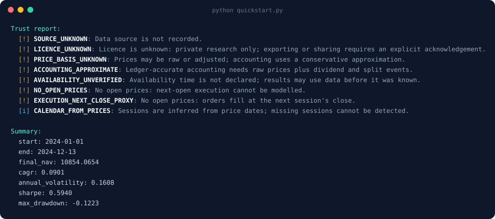

<p align="center">
  
</p>

<h1 align="center">QuantRail</h1>

<p align="center"><b>每個回測都會說點小謊，QuantRail 告訴你謊在哪裡。</b><br>
資料治理 · 帳務正確的模擬 · 研究紀律</p>

<p align="center">
  <a href="https://github.com/ting-hong-shieh/quantrail/actions/workflows/ci.yml"></a>
  
  <a href="LICENSE"></a>
  
  <a href="https://github.com/astral-sh/ruff"></a>
</p>

<p align="center">
  <a href="README.md">English</a> ·
  <a href="docs/zh-TW/architecture.md">架構</a> ·
  <a href="docs/adr/">架構決策</a> ·
  <a href="CONTRIBUTING.md">貢獻指南</a>
</p>

<p align="center">
  
</p>

> **狀態：** 早期開發（v0.x），API 還會變動。本專案內容不構成投資建議。
>
> 本文是英文 README 的翻譯，以英文版為準。

## 為什麼需要 QuantRail？

大多數回測很容易做得好看，卻很難讓人相信：

- 用「部位 × 還原報酬」計算財富，配息、分割、交割只是近似，甚至重複計算；
- 沒有人記錄結果用的是哪個資料版本、什麼授權、資料在什麼時間點才拿得到；
- 找到「贏家」之前試過的許多變體都被遺忘，過度擬合的程度無從衡量。

QuantRail 建立在三個支柱上：

| 支柱 | 內容 |
| --- | --- |
| **資料治理** | 有版本、有 hash 的資料集，manifest 記錄來源、授權、價格種類、時間點可得性與品質檢查。「不知道」是允許的，但一定會被報告，不會被隱藏。 |
| **帳務正確的模擬** | 原始價格加上明確的事件（手續費、稅、配息、分割、交割）。每天的財富變動都必須對得上。 |
| **研究紀律** | 只能追加的 trial 登記、凍結的實驗契約、封存的樣本外資料，以及內建的配對區塊 bootstrap、Holm 校正、Deflated Sharpe Ratio 與回測過度擬合機率（PBO）。 |

## 快速開始

```python
import tempfile

import numpy as np
import pandas as pd

import quantrail as qr
from quantrail.markets.generic import ProportionalCosts

# 任何價格表都可以：只需要日期和收盤價。
days = pd.bdate_range("2024-01-01", periods=250)
returns = np.random.default_rng(0).normal(0.0004, 0.01, 250)
prices = pd.DataFrame({"date": days, "close": 100 * np.exp(np.cumsum(returns))})

store = tempfile.mkdtemp()
data = qr.ingest(prices, root=store, dataset_id="my-prices", version="v1", instrument="X:ABC")

asset = qr.Instrument("X:ABC", "X", "equity", "USD")
result = qr.backtest(data, instrument=asset, capital=10_000,
                     costs=ProportionalCosts(commission_rate="0.001"))
print(result.report())
```

因為什麼都沒有宣告，報告會先列出 QuantRail 無法確認的事項：

```text
Trust report:
  [!] SOURCE_UNKNOWN: Data source is not recorded.
  [!] LICENCE_UNKNOWN: Licence is unknown: private research only; ...
  [!] PRICE_BASIS_UNKNOWN: Prices may be raw or adjusted; ...
  [!] ACCOUNTING_APPROXIMATE: Ledger-accurate accounting needs raw prices plus dividend and split events.
  [!] AVAILABILITY_UNVERIFIED: Availability time is not declared; ...
  [!] NO_OPEN_PRICES: No open prices: next-open execution cannot be modelled.
  [!] EXECUTION_NEXT_CLOSE_PROXY: No open prices: orders fill at the next session's close.
  [i] CALENDAR_FROM_PRICES: Sessions are inferred from price dates; ...
```

宣告資料來源與授權（`qr.Provenance`）、價格種類與可得時間（`qr.Declaration`），再補上開盤價和配息分割事件，這些警告就會一項一項消失。

## 逐分驗證

引擎與台股模組移植自一個私人研究實作，並且必須完全重現它。以一檔台灣 ETF 八年的資料（1,953 個交易日、16 次現金配息、一次 1 拆 4 的分割與一段停止交易），QuantRail 與五組參考執行的每日淨值**差距為零**：包含買進持有，以及三條會賣出的規則（87 筆含證交稅的賣出，其中有使用不交易區間的、也有滑價加倍的）。持股、現金、應收、應付、手續費、稅與滑價也全部一致。

那個參考實作本身經過獨立核對：它的買進持有帳本與總報酬指數核對過，差距全部可由現金拖累、成本與時間對齊解釋，也與第二個資料來源核對過。資料不會散布；只要指向你自己的資料，[`tests/test_reference_parity.py`](tests/test_reference_parity.py) 就會重跑這個比對。

## 市場

| 模組 | 狀態 | 已支援 | 尚未支援 |
| --- | --- | --- | --- |
| `markets.tw_equity`：台股與 ETF | Beta | T+2 交割、含最低費用的手續費、有來源與生效區間的證交稅、現金股利、分割、零股與整張 | 漲跌停、股票股利（[#15](https://github.com/ting-hong-shieh/quantrail/issues/15)） |
| `markets.generic`：任何市場 | 可用 | 比例手續費（含最低費用）、賣出稅 | 市場專屬規則 |
| 加密貨幣 | 規劃中（[#5](https://github.com/ting-hong-shieh/quantrail/issues/5)） | | 先做現貨，再做永續合約 |

QuantRail **不附任何市場資料**。資料由你自己提供，或用你自己的帳號，從條款允許程式化存取的來源取得。本 repo 不包含券商連線或實盤交易。

## 架構

<p align="center">
  
</p>

設計理由見[架構文件](docs/zh-TW/architecture.md)與[架構決策紀錄](docs/adr/)。

## 安裝

```bash
pip install quantrail
```

開發環境：

```bash
git clone https://github.com/ting-hong-shieh/quantrail.git
cd quantrail
uv sync
uv run pytest
```

## 參與貢獻

正確性優先於功能：帳務與統計的修改，必須附上預期值經過獨立計算的測試。每個提交都要簽署（DCO）。詳見 [CONTRIBUTING.md](CONTRIBUTING.md)。

## 授權

Apache-2.0，見 [LICENSE](LICENSE) 與 [NOTICE](NOTICE)。透過 QuantRail 使用的資料，仍受該資料來源本身的條款約束。
