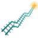
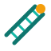

# Brand

## Mark

The QuantRail mark is a railway seen in perspective that climbs like a price chart: up, a pullback, up hard, a pullback, a breakout. The track narrows and its crossties tighten with distance, and the latest print is an amber spark. It is generated geometrically by [`scripts/render_logo.py`](../scripts/render_logo.py); edit the script, not the SVG.

| Form | Use | Image |
| --- | --- | --- |
| Badge (`assets/brand/quantrail-badge.svg`) | Primary: README, avatar, favicon, social preview |  |
| Mark (`assets/brand/quantrail-mark.svg`) | On light documents where a dark tile does not fit |  |

Palette: teal `#0F766E` / `#2DD4BF`, steel `#F8FAFC` → `#99F6E4`, amber `#F59E0B` / `#FBBF24`, night `#020617` / `#0F2A2E`.

## Earlier options

Kept for reference; not used.

| Option | Image |
| --- | --- |
| A — flat track |  |
| B — verified ledger |  |
| C — Q-rail |  |
